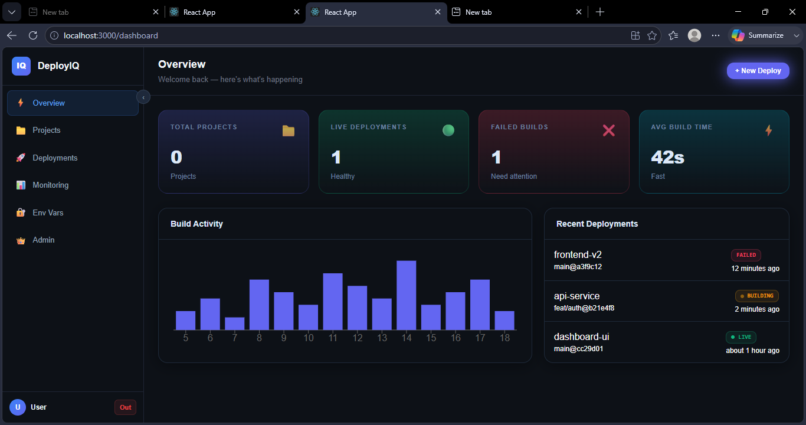
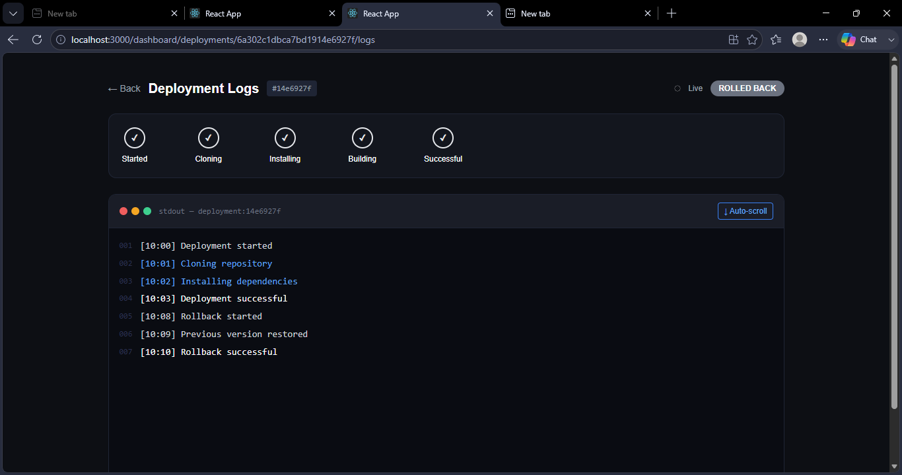
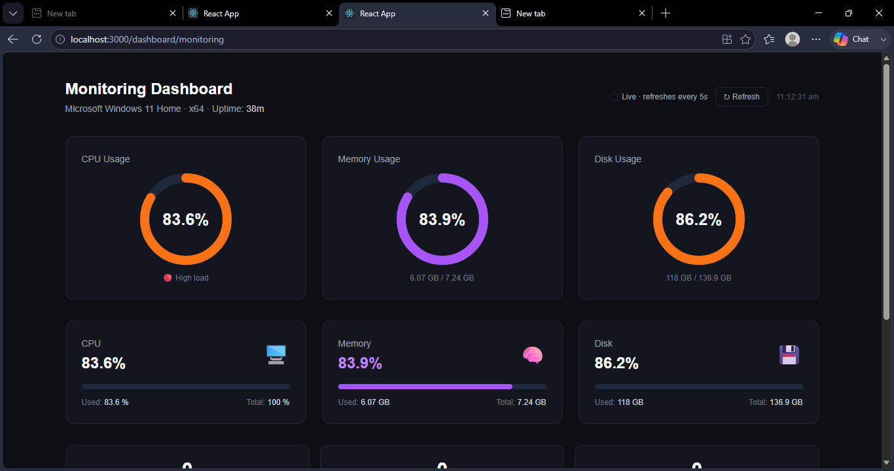
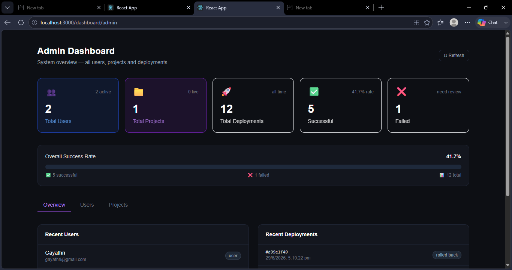
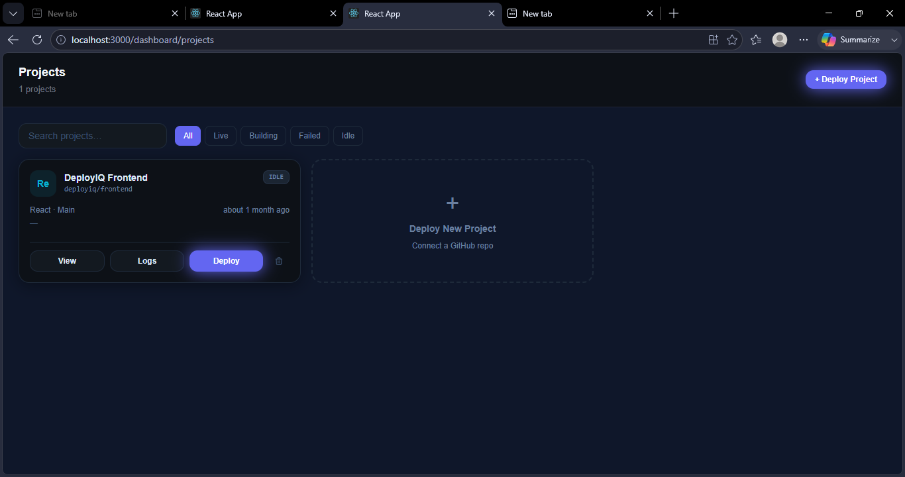
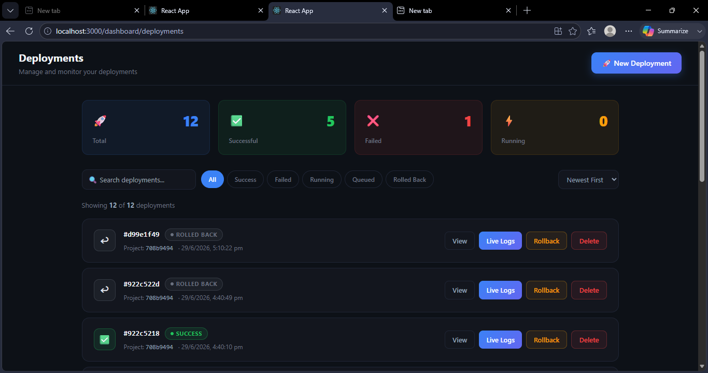

<div align="center">

# 🚀 DeployIQ

### AI-Assisted Deployment Automation Platform

A full-stack DevOps dashboard inspired by Vercel, Render, and Railway — deploy GitHub repositories, stream build logs in real time, and monitor infrastructure from a single control plane.

<p>
  
  
  
  
  
  
</p>

[Features](#-features) · [Architecture](#-architecture) · [Installation](#-installation) · [API Reference](#-api-reference) · [Socket.IO Events](#-socketio-events) · [Project Structure](#-project-structure)

</div>

---

## 📸 Screenshots

| Dashboard | Deployment Logs | Monitoring |
|:--:|:--:|:--:|
|  |  |  |
| Real-time build activity | Live streaming logs | CPU / memory / disk gauges |

| Admin Dashboard | Projects | Deployments |
|:--:|:--:|:--:|
|  |  |  |
| System-wide overview | GitHub repository list | Deployment queue |

---

## ✨ Features

### Authentication
- JWT-based registration and login
- Protected/private routes
- Forgot-password flow
- Persistent sessions

### Project Management
- Create and manage deployment projects
- GitHub repository integration with branch selection
- Automatic framework detection (React, Next.js, Vue, Express, Node.js)

### Deployment Pipeline
- One-click deployments
- Real-time log streaming over Socket.IO
- Sequential deployment queue (one build runs at a time)
- Rollback to any previous deployment
- Full deployment history with timestamps

### Real-Time Updates
- Live logs with no page refresh or polling
- Pipeline step progress indicator
- WebSocket-driven status updates
- Auto-scrolling terminal UI

### Analytics & Monitoring
- Live CPU, memory, and disk usage gauges
- CI/CD dashboard with success rate and deployment trends
- Deployment analytics: totals, successes, failures, rollbacks
- Docker container status and resource stats

### Infrastructure
- Docker container lifecycle management (build, run, stop)
- Nginx configuration generator
- Environment variable management
- Custom domain configuration

### Notifications & Search
- Toast notifications for deploy, rollback, and delete events
- Search deployments by ID or project name
- Filter by status (success, failed, running, queued)
- Sort by newest/oldest

### Admin Console
- Platform-wide totals for users, projects, and deployments
- Success-rate analytics
- Recent users and deployments feed
- Status breakdown by project and deployment

---

## 🛠 Tech Stack

**Frontend**

| Technology | Purpose |
|---|---|
| React 18 | UI framework |
| React Router v6 | Client-side routing |
| Socket.IO Client | Real-time communication |
| Axios | HTTP client |
| React Hot Toast | Notifications |
| Recharts | Analytics charts |
| Tailwind CSS | Styling |
| Zustand | State management |

**Backend**

| Technology | Purpose |
|---|---|
| Node.js | Runtime |
| Express.js | Web framework |
| MongoDB + Mongoose | Database |
| Socket.IO | WebSocket server |
| JWT | Authentication |
| bcryptjs | Password hashing |
| systeminformation | Host system metrics |
| Dockerode | Docker Engine API client |
| simple-git | Git operations |

**Infrastructure**

| Technology | Purpose |
|---|---|
| Docker | Container runtime |
| Nginx | Reverse proxy / config generation |
| GitHub API | Repository integration |
| MongoDB Atlas | Managed database |

---

## 🏗 Architecture

```
┌───────────────────────────────────────────────────────────┐
│                       CLIENT (React)                       │
│   Dashboard · Projects · Deployments · Monitoring          │
│                          │                                  │
│              Axios (REST)  +  Socket.IO                    │
└──────────────────────────┼──────────────────────────────────┘
                           │
┌──────────────────────────┼──────────────────────────────────┐
│               SERVER (Express + Socket.IO)                  │
│                          │                                  │
│   /api/auth  /api/projects  /api/deployments                │
│   /api/monitoring  /api/admin  /api/docker                  │
│                          │                                  │
│   Deployment Pipeline · Queue System                        │
│   Socket Events · Monitoring Service                        │
└──────────────────────────┼──────────────────────────────────┘
                           │
         ┌─────────────────┼─────────────────┐
         │                 │                 │
   ┌─────┴─────┐    ┌──────┴──────┐   ┌──────┴──────┐
   │  MongoDB  │    │   Docker    │   │    Nginx    │
   │   Atlas   │    │ Containers  │   │   Config    │
   └───────────┘    └─────────────┘   └─────────────┘
```

**Deployment pipeline flow:**

```
GitHub Repo → Clone → Detect Framework → Install Dependencies
            → Build → Create Docker Image → Start Container
            → Generate Nginx Config → Deployment Live
```

---

## 📦 Installation

### Prerequisites
- Node.js 18+
- MongoDB (local instance or Atlas cluster)
- Docker (optional — required for container management features)
- Git

### 1. Clone the repository
```bash
git clone https://github.com/yourusername/deployiq.git
cd deployiq
```

### 2. Backend setup
```bash
cd server
npm install
```

Create `server/.env`:
```env
PORT=5000
NODE_ENV=development
MONGO_URI=mongodb+srv://your-connection-string
JWT_SECRET=your_super_secret_key
JWT_EXPIRE=7d
FRONTEND_URL=http://localhost:3000
DOCKER_HOST=/var/run/docker.sock
ENCRYPTION_KEY=your_32_char_key
GITHUB_CLIENT_ID=your_github_client_id
GITHUB_CLIENT_SECRET=your_github_client_secret
GITHUB_CALLBACK_URL=http://localhost:5000/api/github/callback
```

Start the server:
```bash
npm run dev
```

### 3. Frontend setup
```bash
cd client
npm install
```

Create `client/.env`:
```env
REACT_APP_API_URL=http://localhost:5000
```

Start the client:
```bash
npm start
```

### 4. Open the app
```
http://localhost:3000
```

---

## 📡 API Reference

**Authentication**

| Method | Endpoint | Description |
|---|---|---|
| POST | `/api/auth/register` | Register a new user |
| POST | `/api/auth/login` | Log in |
| POST | `/api/auth/forgot-password` | Send password reset email |

**Projects**

| Method | Endpoint | Description |
|---|---|---|
| GET | `/api/projects` | List all projects |
| POST | `/api/projects` | Create a project |
| GET | `/api/projects/:id` | Get a single project |
| PUT | `/api/projects/:id` | Update a project |
| DELETE | `/api/projects/:id` | Delete a project |

**Deployments**

| Method | Endpoint | Description |
|---|---|---|
| GET | `/api/deployments` | List all deployments |
| POST | `/api/deployments` | Create a deployment |
| GET | `/api/deployments/queue` | Get queue status |
| GET | `/api/deployments/:id` | Get a single deployment |
| DELETE | `/api/deployments/:id` | Delete a deployment |
| POST | `/api/deployments/:id/rollback` | Roll back a deployment |

**Monitoring**

| Method | Endpoint | Description |
|---|---|---|
| GET | `/api/monitoring/summary` | CPU, memory, disk, container overview |
| GET | `/api/monitoring/system` | System stats only |
| GET | `/api/monitoring/containers` | Docker container status |

**Admin**

| Method | Endpoint | Description |
|---|---|---|
| GET | `/api/admin/summary` | Full system overview |
| GET | `/api/admin/users` | List all users |
| GET | `/api/admin/projects` | List all projects |

**Docker**

| Method | Endpoint | Description |
|---|---|---|
| POST | `/api/docker/clone` | Clone a repository |
| POST | `/api/docker/build` | Build a Docker image |
| POST | `/api/docker/run` | Start a container |
| POST | `/api/docker/stop` | Stop a container |
| GET | `/api/docker/containers` | List containers |
| GET | `/api/docker/stats` | Get container stats |

---

## 🔌 Socket.IO Events

**Client → Server**

| Event | Payload | Description |
|---|---|---|
| `join-deployment` | `deploymentId` | Join a deployment's log room |
| `leave-deployment` | `deploymentId` | Leave a deployment's log room |

**Server → Client**

| Event | Payload | Description |
|---|---|---|
| `deployment-log` | `string` | New log line |
| `deployment-status` | `string` | Status change |
| `queue-position` | `{ position }` | Queue position update |

---

## 📁 Project Structure

```
DeployIQ/
├── server/
│   ├── server.js                        # Entry point + Socket.IO setup
│   └── src/
│       ├── config/
│       │   └── db.js                    # MongoDB connection
│       ├── controllers/
│       │   ├── authController.js
│       │   ├── deploymentController.js   # Pipeline + queue logic
│       │   ├── dockerController.js
│       │   ├── monitoringController.js
│       │   └── adminController.js
│       ├── models/
│       │   ├── User.js
│       │   ├── Project.js
│       │   └── deployment.js
│       ├── routes/
│       │   ├── authRoutes.js
│       │   ├── deploymentRoutes.js
│       │   ├── monitoringRoutes.js
│       │   └── adminRoutes.js
│       └── middleware/
│           ├── authMiddleware.js
│           ├── errorHandler.js
│           └── rateLimiterMiddleware.js
│
└── client/
    └── src/
        ├── pages/
        │   ├── auth/                     # Login, Register, ForgotPassword
        │   ├── Dashboards/                # Dashboard, Projects, Logs
        │   ├── DeploymentPage.jsx
        │   ├── MonitoringDashboard.jsx
        │   └── AdminDashboard.jsx
        ├── layouts/
        │   └── DashboardLayout.jsx
        ├── api/                           # Axios API calls
        ├── store/                         # Zustand stores
        ├── utils/
        │   └── toast.js                   # Toast notification helpers
        └── socket.js                      # Socket.IO client
```

---

## 🎯 Key Implementation Notes

**Real-time deployment logs** — Socket.IO rooms give each deployment its own channel. The pipeline emits log events as each step completes, streaming straight to the browser with no polling required.

**Deployment queue** — an in-memory queue guarantees only one deployment runs at a time; new deployments are enqueued and processed automatically as earlier ones finish.

**System monitoring** — the `systeminformation` package reads live CPU, memory, and disk metrics directly from the host OS, refreshed every 5 seconds.

**Docker integration** — `dockerode` communicates with the Docker daemon over its Unix socket, supporting container listing, start/stop control, and live stats.

---

## 🚀 Deployment

**Frontend → Vercel**
```bash
cd client
npm run build
# Deploy the build/ folder to Vercel
```

**Backend → Render / Railway**
```bash
# Configure environment variables in your provider's dashboard
# Connect the GitHub repository
# Deploy the server/ folder
```

**Database → MongoDB Atlas**
```
Create a free cluster at mongodb.com/atlas
Copy the connection string into MONGO_URI
```

---

## 🏆 What This Project Demonstrates

| Skill | Implementation |
|---|---|
| Full-stack development | React frontend + Node.js/Express backend |
| Real-time communication | Socket.IO WebSocket integration |
| Database design | MongoDB schemas, relationships, aggregation |
| Authentication | JWT, bcrypt, protected routes |
| DevOps concepts | Docker, Nginx, simulated CI/CD pipeline |
| Systems programming | Host OS metrics, Docker Engine API |
| Queue systems | In-memory deployment queue |
| REST API design | 20+ endpoints across 10+ resources |
| State management | Zustand |
| UI/UX | Dark theme, responsive layout, real-time updates |

---

## 👤 Author

**Your Name**
[GitHub](https://github.com/yourusername) · [LinkedIn](https://linkedin.com/in/yourprofile) · [Portfolio](https://yourportfolio.com)

---

## 📄 License

Released under the [MIT License](LICENSE) — free to use as a reference or template.

<div align="center">

Built as a portfolio project to demonstrate full-stack and DevOps engineering skills.

</div>